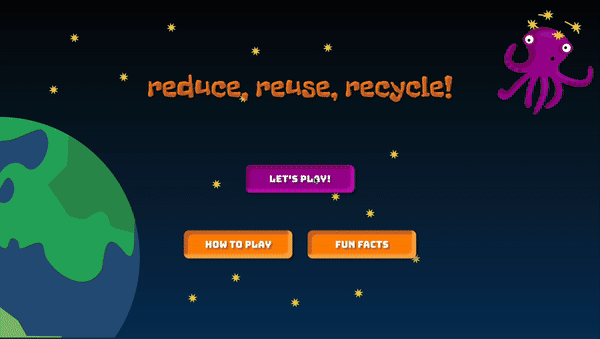
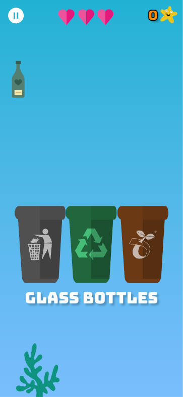
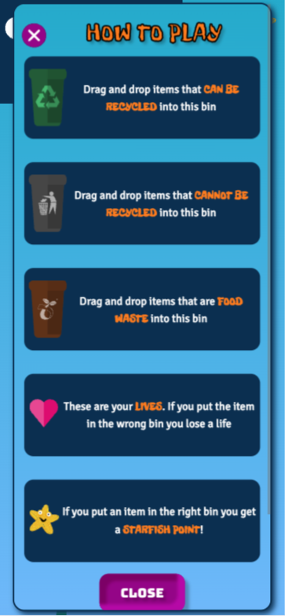
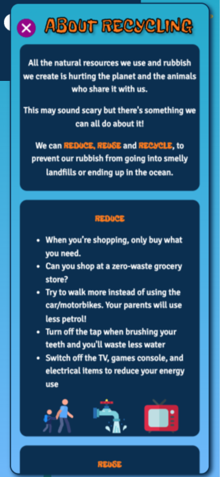
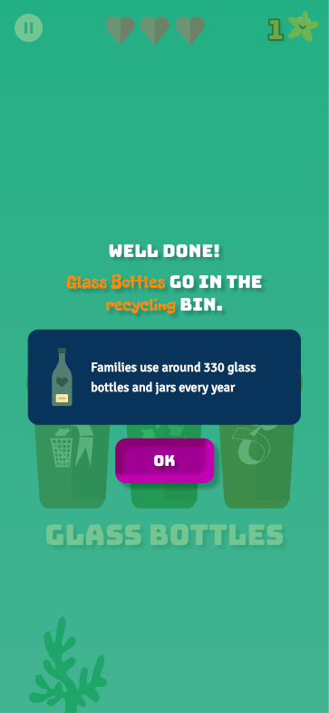
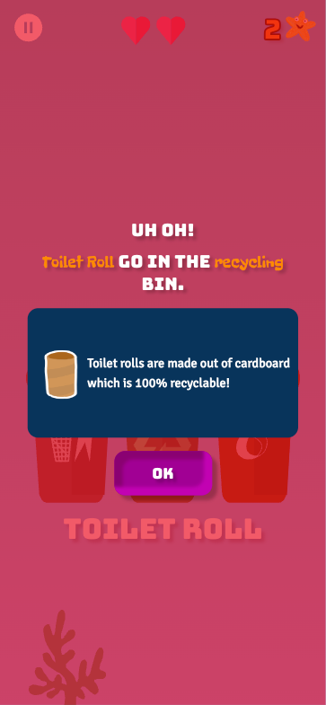
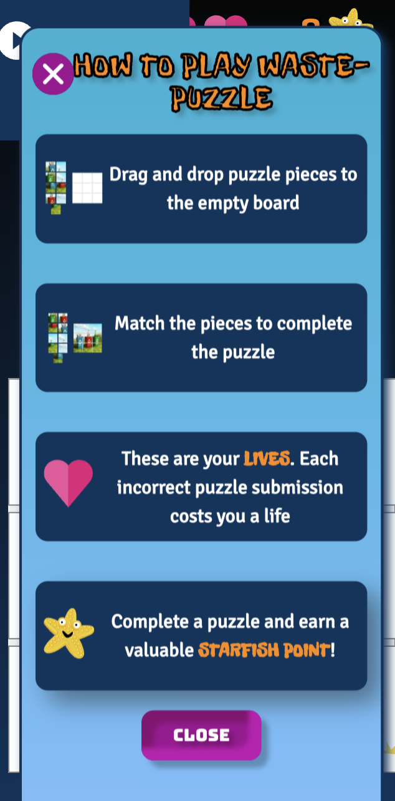
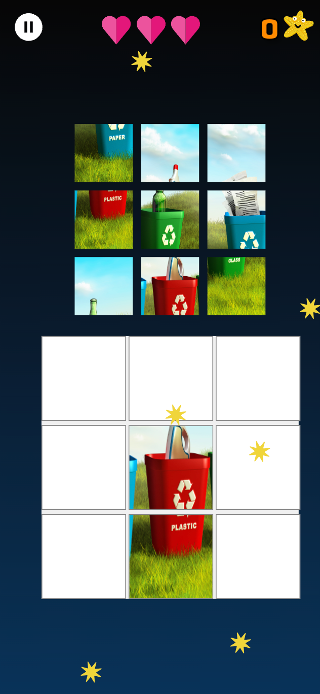
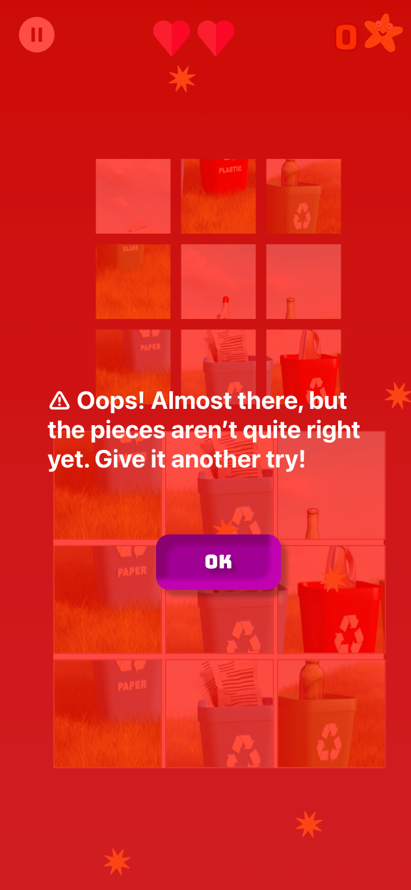
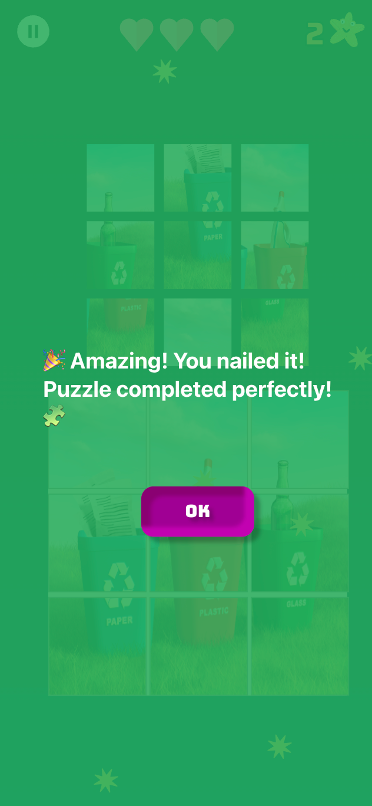

# Recycling Game for Children (Ages 4-6)

This is a fun and educational recycling game designed for children aged 4-6 years old! Our game aims to teach young children the importance of recycling in an engaging and interactive way. By playing the game, children will learn how to properly sort different types of waste, understand the benefits of recycling, and develop eco-friendly habits from an early age.

### Screenshots

### Waste Sorting  ♻️

### Waste Puzzle 🧩

## Getting Started
This project was created with [Create React App](https://github.com/facebook/create-react-app).

### Available Scripts
In the project directory, you can run:

#### `npm start`
Runs the app in development mode. Open [http://localhost:3000](http://localhost:3000) to view it in the browser. The page will reload if you make edits, and you will also see any lint errors in the console.

#### `npm test`
Launches the test runner in interactive watch mode. See the section about [running tests](https://facebook.github.io/create-react-app/docs/running-tests) for more information.

#### `npm run build`
Builds the app for production to the `build` folder. It correctly bundles React in production mode and optimizes the build for the best performance. The build is minified and the filenames include the hashes. Your app is ready to be deployed! See the section about [deployment](https://facebook.github.io/create-react-app/docs/deployment) for more information.

#### `npm run eject`
**Note: this is a one-way operation. Once you `eject`, you can’t go back!** This command will remove the single build dependency from your project. It will copy all the configuration files and dependencies (Webpack, Babel, ESLint, etc.) right into your project so you have full control over them. At this point, you’re on your own. You don’t have to ever use `eject`, but it's an option if you need to customize the configuration.

## Learn More
- [Create React App documentation](https://facebook.github.io/create-react-app/docs/getting-started)
- [React documentation](https://reactjs.org/)

### Additional Resources
- [Code Splitting](https://facebook.github.io/create-react-app/docs/code-splitting)
- [Analyzing the Bundle Size](https://facebook.github.io/create-react-app/docs/analyzing-the-bundle-size)
- [Making a Progressive Web App](https://facebook.github.io/create-react-app/docs/making-a-progressive-web-app)
- [Advanced Configuration](https://facebook.github.io/create-react-app/docs/advanced-configuration)
- [Deployment](https://facebook.github.io/create-react-app/docs/deployment)
- [Troubleshooting Build Errors](https://facebook.github.io/create-react-app/docs/troubleshooting#npm-run-build-fails-to-minify)

## Acknowledgment
This project is detached from fac18 [recycling-game](https://github.com/fac18/recycling-game).